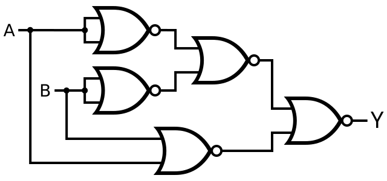
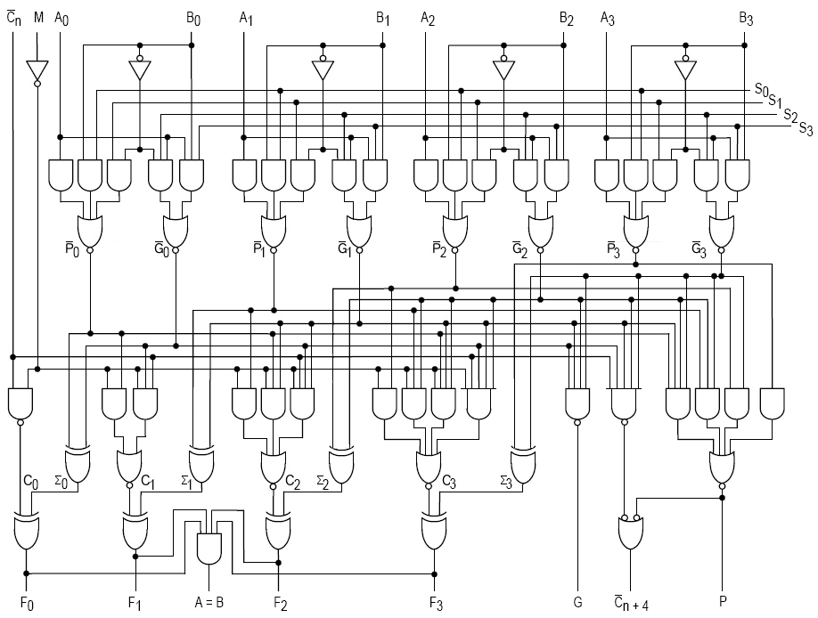

  

::: {.text-end}
> *"Nature proposes an 'AND'. Our observation enforces an 'OR'."*  
> — **Professor Alvin**
:::

---

[](https://colab.research.google.com/github/nicdeclic/quantum-molecular-computing/blob/main/posts/boolean-logic/index.ipynb)
```{python}
#| echo: true
#| code-fold: true
#| code-summary: "Click to see library imports"

import sys
if 'google.colab' in sys.modules:
    # 1. Download qmc.py from GitHub
    !wget -q https://raw.githubusercontent.com/nicdeclic/quantum-molecular-computing/main/qmc.py
    
    # 2. Download requirements.txt from GitHub
    !wget -q https://raw.githubusercontent.com/nicdeclic/quantum-molecular-computing/main/requirements.txt

    # 3. Install dependencies
    !pip install -q -r requirements.txt

sys.path.insert(0, "../..") # Select root directory
from qmc import * # QMC library

%reload_ext autoreload
%autoreload 2

```

---

## Logical States 

Before diving into the fascinating realm of quantum logic, mastering the fundamentals of classical logic and traditional logic gates is essential.  

Logic gates are the foundational building blocks of digital electronics and modern computing. They manipulate binary signals—units of information represented by bits that take one of two distinct values: "0" (false, low, off) or "1" (true, high, on).

---

## Logical Gates 

Basic logic gates are the elementary building blocks of any digital system. These gates are: **NOT**, **AND**, **OR**, **NAND**, **NOR**, **XOR**, and **XNOR**. Each gate exhibits a specific behavior, formally defined by a truth table that maps its inputs to its output.  

### The NOT Gate (Inverter)
The NOT gate is the simplest of all logic gates. It takes a single input and returns its inverse.

Symbol :
```{python}
#| code-fold: true

# 1. Initialize the drawing context
with schemdraw.Drawing() as d:
    # Set global configuration for clean technical typography
    d.config(fontsize=14, unit=2.5)

    # 2. Add an input lead line on the left, labeled 'A'
    input_line = d.add(elm.Line().right(1.5).label('A', loc='left'))

    # 3. Add the NOT gate (inverter with bubble) connected to the input
    # The output label 'Y' can be written with LaTeX notation: $\overline{A}$
    not_gate = d.add(
        logic.Not()
        .right()
        .at(input_line.end)
    )

    # 4. Add an output lead line extending to the right, labeled 'Y'
    d.add(
        elm.Line()
        .right(1.5)
        .at(not_gate.out)
        .label('$Y$', loc='right')
    )


```

| Input ($A$) | Output ($Y$) |
|:---:|:---:|
| 0 | 1 |
| 1 | 0 |

: Truth Table: NOT Gate {.table .table-bordered .table-hover}

The output is the inverse of the input.

  

Throughout this blog, we will express all circuits in matrix form. So, we might as well get comfortable with this concept right from the start.

You can think of a matrix as a “box” that embodies a function.

They all share the exact same format:  
- **The rows** correspond to an enumeration of all possible input combinations.  
- **The columns** correspond to an enumeration of all possible output combinations.  

If a function has $M$ binary inputs and $N$ binary outputs, the resulting matrix will have $2^M$ rows and $2^N$ columns.  

The column containing the value **1** marks the precise spot where a given input maps to its corresponding output. This is known as a transition matrix in mathematics.

Here is the matrix representing the NOT gate. Labels representing the inputs on the left and the outputs on the top have been added for increased readability :

```{python}
#| code-fold: true

display_inline("Not", "=", not_q.to_katex(show_labels=True))

```

Rather than using standard matrix brackets, transition matrices are intentionally rendered as closed grid boxes. This visually reinforces their role as discrete computational components mapping input configurations to output states.  
(Yes, this is a feature, not a bug.)

Even the logical states follow the same format. You can think of a logical state as a function with zero input and one output (the logical state).

```{python}
#| code-fold: true

display_inline("Zero", "=", zero_out.to_katex(show_labels=True))
display_inline("and")
display_inline("One", "=", one_out.to_katex(show_labels=True))

```

### The AND Gate

The output is `1` only if both inputs $A$ and $B$ are `1`.

Symbol :
```{python}
#| code-fold: true

# 1. Initialize the drawing context
with schemdraw.Drawing() as d:
    # Set global configuration for crisp, technical diagrams
    d.config(fontsize=14, unit=2.5)

    # 2. Add the 2-input AND gate
    and_gate = d.add(logic.And().right())

    # 3. Add input lead lines on the left, labeled 'A' and 'B'
    d.add(elm.Line().left(1.5).at(and_gate.in1).label('A', loc='left'))
    d.add(elm.Line().left(1.5).at(and_gate.in2).label('B', loc='left'))

    # 4. Add the output lead line on the right, labeled 'Y'
    d.add(elm.Line().right(1.5).at(and_gate.out).label('Y', loc='right'))
```

| Input $A$ | Input $B$ | Output $Y$ |
|:---:|:---:|:---:|
| 0 | 0 | 0 |
| 0 | 1 | 0 |
| 1 | 0 | 0 |
| 1 | 1 | 1 |

: Truth Table: AND Gate {.table .table-bordered .table-hover}

Matrix form :
```{python}
#| code-fold: true

display_inline("And", "=", and_q.to_katex(show_labels=True))

```

---

### The OR Gate

The output is `1` if at least one of the inputs is `1`.

Symbol :
```{python}
#| code-fold: true

# 1. Initialize the drawing context
with schemdraw.Drawing() as d:
    # Set global configuration for crisp, technical diagrams
    d.config(fontsize=14, unit=2.5)

    # 2. Add the 2-input OR gate
    and_gate = d.add(logic.Or().right())

    # 3. Add input lead lines on the left, labeled 'A' and 'B'
    d.add(elm.Line().left(1.5).at(and_gate.in1).label('A', loc='left'))
    d.add(elm.Line().left(1.5).at(and_gate.in2).label('B', loc='left'))

    # 4. Add the output lead line on the right, labeled 'Y'
    d.add(elm.Line().right(1.5).at(and_gate.out).label('Y', loc='right'))
```

| Input $A$ | Input $B$ | Output $Y$ |
|:---:|:---:|:---:|
| 0 | 0 | 0 |
| 0 | 1 | 1 |
| 1 | 0 | 1 |
| 1 | 1 | 1 |

: Truth Table: OR Gate {.table .table-bordered .table-hover}

Matrix form :
```{python}
#| code-fold: true

display_inline("Or", "=", or_q.to_katex(show_labels=True))

```

---

### The NAND Gate (NOT-AND)

The output is `0` only when both inputs are `1`.

Symbol :
```{python}
#| code-fold: true

# 1. Initialize the drawing context
with schemdraw.Drawing() as d:
    # Set global configuration for crisp, technical diagrams
    d.config(fontsize=14, unit=2.5)

    # 2. Add the 2-input NAND gate
    and_gate = d.add(logic.Nand().right())

    # 3. Add input lead lines on the left, labeled 'A' and 'B'
    d.add(elm.Line().left(1.5).at(and_gate.in1).label('A', loc='left'))
    d.add(elm.Line().left(1.5).at(and_gate.in2).label('B', loc='left'))

    # 4. Add the output lead line on the right, labeled 'Y'
    d.add(elm.Line().right(1.5).at(and_gate.out).label('Y', loc='right'))
```

| Input $A$ | Input $B$ | Output $Y$ |
|:---:|:---:|:---:|
| 0 | 0 | 1 |
| 0 | 1 | 1 |
| 1 | 0 | 1 |
| 1 | 1 | 0 |

: Truth Table: NAND Gate {.table .table-bordered .table-hover}

Matrix form :
```{python}
#| code-fold: true

display_inline("Nand", "=", nand_q.to_katex(show_labels=True))

```

---

### The NOR Gate (NOT-OR)

The output is `1` only when both inputs are `0`.

Symbol :
```{python}
#| code-fold: true

# 1. Initialize the drawing context
with schemdraw.Drawing() as d:
    # Set global configuration for crisp, technical diagrams
    d.config(fontsize=14, unit=2.5)

    # 2. Add the 2-input NOR gate
    and_gate = d.add(logic.Nor().right())

    # 3. Add input lead lines on the left, labeled 'A' and 'B'
    d.add(elm.Line().left(1.5).at(and_gate.in1).label('A', loc='left'))
    d.add(elm.Line().left(1.5).at(and_gate.in2).label('B', loc='left'))

    # 4. Add the output lead line on the right, labeled 'Y'
    d.add(elm.Line().right(1.5).at(and_gate.out).label('Y', loc='right'))
```

| Input $A$ | Input $B$ | Output $Y$ |
|:---:|:---:|:---:|
| 0 | 0 | 1 |
| 0 | 1 | 0 |
| 1 | 0 | 0 |
| 1 | 1 | 0 |

: Truth Table: NOR Gate {.table .table-bordered .table-hover}

Matrix form :
```{python}
#| code-fold: true

display_inline("Nor", "=", nor_q.to_katex(show_labels=True))

```

---

### The XOR Gate (Exclusive OR)

The output is `1` if the inputs are different, and `0` if they are identical.

Symbol :
```{python}
#| code-fold: true

# 1. Initialize the drawing context
with schemdraw.Drawing() as d:
    # Set global configuration for crisp, technical diagrams
    d.config(fontsize=14, unit=2.5)

    # 2. Add the 2-input XOR gate
    and_gate = d.add(logic.Xor().right())

    # 3. Add input lead lines on the left, labeled 'A' and 'B'
    d.add(elm.Line().left(1.5).at(and_gate.in1).label('A', loc='left'))
    d.add(elm.Line().left(1.5).at(and_gate.in2).label('B', loc='left'))

    # 4. Add the output lead line on the right, labeled 'Y'
    d.add(elm.Line().right(1.5).at(and_gate.out).label('Y', loc='right'))
```

| Input $A$ | Input $B$ | Output $Y$ |
|:---:|:---:|:---:|
| 0 | 0 | 0 |
| 0 | 1 | 1 |
| 1 | 0 | 1 |
| 1 | 1 | 0 |

: Truth Table: XOR Gate {.table .table-bordered .table-hover}

Matrix form :
```{python}
#| code-fold: true

display_inline("Xor", "=", xor_q.to_katex(show_labels=True))

```

---

### The XNOR Gate (Equivalence Gate)

The inverse of XOR. The output is `1` only if the inputs are identical.

Symbol :
```{python}
#| code-fold: true

# 1. Initialize the drawing context
with schemdraw.Drawing() as d:
    # Set global configuration for crisp, technical diagrams
    d.config(fontsize=14, unit=2.5)

    # 2. Add the 2-input XNOR gate
    and_gate = d.add(logic.Xnor().right())

    # 3. Add input lead lines on the left, labeled 'A' and 'B'
    d.add(elm.Line().left(1.5).at(and_gate.in1).label('A', loc='left'))
    d.add(elm.Line().left(1.5).at(and_gate.in2).label('B', loc='left'))

    # 4. Add the output lead line on the right, labeled 'Y'
    d.add(elm.Line().right(1.5).at(and_gate.out).label('Y', loc='right'))
```

| Input $A$ | Input $B$ | Output $Y$ |
|:---:|:---:|:---:|
| 0 | 0 | 1 |
| 0 | 1 | 0 |
| 1 | 0 | 0 |
| 1 | 1 | 1 |

: Truth Table: XNOR Gate {.table .table-bordered .table-hover}

Matrix form :
```{python}
#| code-fold: true

display_inline("Xnor", "=", xnor_q.to_katex(show_labels=True))

```

---

## Matrix arithmetic

The beauty of this representation is that functions can be chained together end-to-end using standard matrix multiplication.

For example, if we have a state corresponding to the bit "1" and pass it through a NOT gate, we can simply compute:

```{python}
#| code-fold: true

display_inline("One", r"\cdot", "Not", "=", one_out.to_katex(show_labels=False), r"\cdot", not_q.to_katex(show_labels=False), "=", (one_out @ not_q).to_katex(show_labels=False))

```
And this yields the expected result: Zero.

#### Kronecker Product

For logic gates with two inputs, $A$ and $B$, one might naively expect something like $A \cdot B \cdot \text{AND}$. However, that will not work dimensionally. $A$ and $B$ are $1 \times 2$ matrices, whereas the $\text{AND}$ gate is a $4 \times 2$ matrix. 

To give the inputs, $A$ and $B$, the proper dimension to interface with the AND gate, they must first be combined using the **Kronecker tensor product** ($A \otimes B$).

This operation takes two matrices of arbitrary sizes and constructs a larger composite matrix. It is the fundamental mathematical tool used to describe the **joint state** of independent systems.

##### The Formal Rule
If matrix $A$ has dimensions $m \times n$ and matrix $B$ has dimensions $p \times q$, their Kronecker product $A \otimes B$ is a block matrix of size $(m \cdot p) \times (n \cdot q)$ obtained by multiplying every single element of $A$ by the entire matrix $B$:

$$
A \otimes B = \begin{pmatrix}
a_{11} B & a_{12} B & \cdots & a_{1n} B \\
a_{21} B & a_{22} B & \cdots & a_{2n} B \\
\vdots & \vdots & \ddots & \vdots \\
a_{m1} B & a_{m2} B & \cdots & a_{mn} B
\end{pmatrix}
$$

##### A Concrete Example with Input Bits (Row Vectors)
In our framework, single-bit inputs are represented as $1 \times 2$ matrices.

To find the composite matrix for the input pair $(A = 1, B = 0)$, we compute $\text{One} \otimes \text{Zero}$:

$$
\text{One} \otimes \text{Zero} = 
\begin{pmatrix} 0 & 1 \end{pmatrix} \otimes \begin{pmatrix} 1 & 0 \end{pmatrix}
$$

We distribute each component of the first vector across the second vector:

$$
\text{One} \otimes \text{Zero} = 
\begin{pmatrix} 0 \cdot \begin{pmatrix} 1 & 0 \end{pmatrix} & 1 \cdot \begin{pmatrix} 1 & 0 \end{pmatrix} \end{pmatrix}
= \begin{pmatrix} 0 & 0 & 1 & 0 \end{pmatrix}
$$

The resulting $1 \times 4$ matrix cleanly indexes the fourth basis state (corresponding to binary `"10"`), making it dimensionally compatible with any 2-input gate matrix.

Here`s an enumeration of all 4 possibilities for A and B with labels included:
```{python}
#| code-fold: true

display_inline(zero_out.to_katex(show_labels=True), r"\otimes", zero_out.to_katex(show_labels=True), "=", (zero_out ^ zero_out).to_katex(show_labels=True))

display_inline(zero_out.to_katex(show_labels=True), r"\otimes", one_out.to_katex(show_labels=True), "=", (zero_out ^ one_out).to_katex(show_labels=True))

display_inline(one_out.to_katex(show_labels=True), r"\otimes", zero_out.to_katex(show_labels=True), "=", (one_out ^ zero_out).to_katex(show_labels=True))

display_inline(one_out.to_katex(show_labels=True), r"\otimes", one_out.to_katex(show_labels=True), "=", (one_out ^ one_out).to_katex(show_labels=True))
```

Notice how the output string labels combine? This makes it easy to find any mistake.

Let`s now take for example A="1" and B="1" and pass them through an AND gate :
```{python}
#| code-fold: true

A = one_out
B = one_out

AB = (A ^ B)

display_inline("(A", r"\otimes", "B)", r"\cdot", "And", "=", AB, r"\cdot", and_q, "=", (AB) @ and_q)
```

And we get a "1" as expected.

---

## Universal gates

NAND and NOR gates are known as **universal gates** because they can be used to construct every other logic gate on their own. This means that, given enough NAND or NOR gates, any arbitrary logic circuit can be realized.

The following is an XOR gate constructed using only NOR gates :

  

These elementary gates serve as the building blocks for much more complex digital architectures — such as the Arithmetic Logic Unit (ALU), which lies at the very heart of modern microprocessors:

  

---

👉 **Next chapter :**  
**["The Computing Universe"](/posts/computing-universe/index.html)**