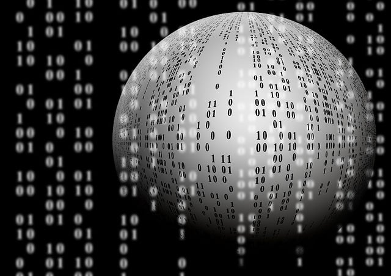
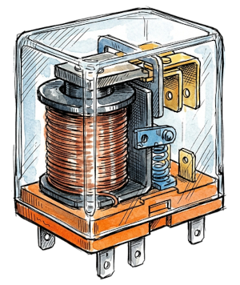
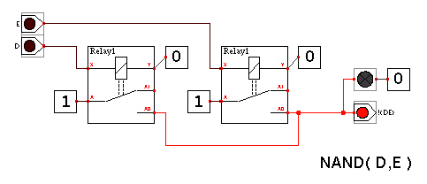
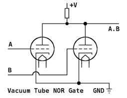
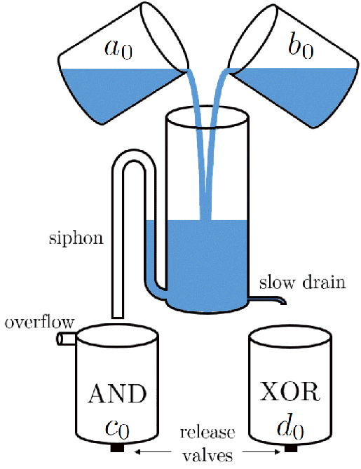
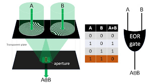

  

::: {.text-end}
> *"Truth is not a stone to be thrown. It is a river that polishes the rocks. Drink from it too quickly, and you will taste only sand."*  
> — **Professor Alvin**
:::

---

## Logical Systems

While we are most familiar with logic gates built using silicon transistors, there are many other fascinating ways to implement logical systems. These alternative substrates demonstrate that Boolean logic is fundamentally an abstract mathematical concept that can be embodied in countless physical forms, often in surprising and ingenious ways.  
Here are a few notable examples:

### Electromechanical Relays
Relays are electromechanical devices that use an electromagnet to physically open or close an electrical circuit. They were widely used in early computing machinery, such as early electromechanical Turing machines, to implement logic gates. Although slower and more prone to mechanical wear than transistors, relays were a pivotal milestone in the history of computer engineering.

::: {layout-ncol=2 layout-valign="center"}
{height="300px"}

{height="300px"}
:::

### Vacuum Tubes
Following relays, thermionic valves (vacuum tubes) became the dominant technology for constructing logic gates. Despite being bulky, fragile, and power-hungry, these devices played a crucial role in the birth of electronic computing, powering machines like ENIAC.

::: {layout-ncol=2 layout-valign="center"}
{height="300px"}

{height="300px"}
:::

### Mechanical Systems (Marbles, Gears)
Purely mechanical systems can be designed to represent binary states (for example, the physical position of a marble or the discrete rotation of a gear) and execute logical operations. While intrinsically slow, these systems offer a tactile, highly visual demonstration of computation.  

* Marble-based logic systems:  

* LEGO-based mechanisms:  



* Pulley and weight systems:  



### Fluidics (Water, Air)
Fluidic logic systems utilize liquids or gases to represent bits (such as the presence, absence, or pressure level of a fluid within a channel) to perform operations without moving mechanical parts. These setups are often used to demonstrate control logic in harsh, radiation-heavy environments or for intuitive educational models.  

* Water-based fluidic systems:

### Optics (Lasers, Mirrors)
Optical computing leverages photons to represent bits and process information. By manipulating light beams through lasers, beam splitters, mirrors, and non-linear optical crystals, logic gates can theoretically operate at the speed of light with minimal heat dissipation.  

* Laser-based optical systems:

{height="400px"}

### Unconventional Binary Substrates
Beyond these classical media, an almost limitless variety of physical systems can compute. Researchers have successfully implemented logic using plant root growth patterns, DNA strand displacement, engineered bacterial colonies, magnetic domain walls, and even swarms of soldier crabs.

**["Computer Scientists Build Computer Using Swarms of Crabs"](https://www.technologyreview.com/2012/04/12/186779/computer-scientists-build-computer-using-swarms-of-crabs/)**

Exploring these alternative substrates does more than broaden our intellectual appreciation of logic; it paves the way for technologies that could disrupt medicine, molecular robotics, distributed sensing, and environmental monitoring.  
While many remain at the proof-of-concept stage, they stand as a testament to human ingenuity and our ability to rethink the physical foundations of computation.

---

### Designing a Universal Physical Computer
Imagine we now want to create a computer using an entirely new physical substrate, capable of executing arbitrary algorithms. To achieve this, the system must not only implement a set of universal logic gates, but it must also satisfy rigorous operational criteria to function as a **Turing-complete** machine:

* **Physical State Representation:** First and foremost, we must unambiguously define how Boolean states are physically encoded. The reliability of this encoding is vital to ensure deterministic, noise-resilient operations. In classical electronics, "0" and "1" correspond to low and high voltage thresholds; in a mechanical computer, they might correspond to the spatial coordinates of a marble or the angle of a latch.
* **Signal Propagation and Fan-out:** The system must reliably transmit signals across space while minimizing dissipation and crosstalk. This requires an efficient transport mechanism capable of driving the output of one gate into the inputs of multiple subsequent gates (fan-out) without signal degradation. In electronics, this is achieved through metallic traces; in fluidics, via micro-channels; in optics, through waveguides or optical fibers.
* **State Retention and Control:** Finally, a complete computational architecture demands memory (the ability to store intermediate states) and a control mechanism. Control ensures that operations occur in a well-defined sequence and that system states evolve coherently over time.

---

### The Scaling Wall: From Silicon Transistors to Molecules
From an engineering standpoint, computational performance has historically been driven by scaling. To increase throughput and reduce latency, the prevailing strategy has been aggressive miniaturization—shrinking physical components to pack higher circuit densities onto a single die while boosting operating clock frequencies.

However, this scaling paradigm is now running into hard physical barriers. At the sub-nanometer scale, traditional silicon transistors run headlong into destructive quantum phenomena, such as parasitic electron tunneling and quantum interference, which trigger leakage currents and compromise deterministic switching. These effects, once negligible, now pose severe technical and thermodynamic bottlenecks.

Rather than treating quantum effects as adversaries to be suppressed, a radically different approach is to **embrace and exploit them**. 

By harnessing quantum behavior natively, we can design computational architectures operating on fundamentally new principles. This paradigm shift leads directly to a compelling frontier: **implementing computational logic at the molecular scale.**

By turning quantum mechanics into an asset rather than an obstacle, this strategy marks a clean conceptual break from traditional computing. It reveals how Boolean logic, though classical in its abstract formulation, can be mapped onto domains where quantum mechanics governs the physical substrate—opening up entirely uncharted territories for the future of information processing.

---

👉 **Next chapter :**  
**["Quantum Chemistry"](/posts/quantum-chemistry/index.html)**