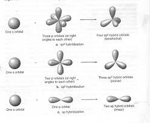
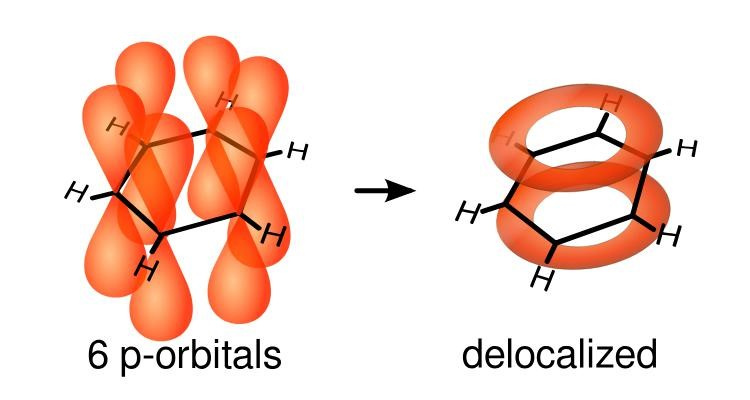

  

::: {.text-end}
> *"An atom has no identity of its own. Only a function within the whole."*  
> — **Professor Alvin**
:::

---

[](https://colab.research.google.com/github/nicdeclic/quantum-molecular-computing/blob/main/posts/quantum-chemistry/index.ipynb)
```{python}
#| echo: true
#| code-fold: true
#| code-summary: "Click to see library imports"

import sys
if 'google.colab' in sys.modules:
    # 1. Download qmc.py from GitHub
    !wget -q https://raw.githubusercontent.com/nicdeclic/quantum-molecular-computing/main/qmc.py
    
    # 2. Download requirements.txt from GitHub
    !wget -q https://raw.githubusercontent.com/nicdeclic/quantum-molecular-computing/main/requirements.txt

    # 3. Install dependencies
    !pip install -q -r requirements.txt

sys.path.insert(0, "../..") # Select root directory
from qmc import * # QMC library

%reload_ext autoreload
%autoreload 2

```

---

## Computing Molecules

Could it be that the capacity to process and manipulate information is woven into the very fabric of molecules?  

We now turn to explore the untapped potential of atoms and their chemical bonds to create sophisticated computational systems.

---

## Chemical Bonds

The molecules of primary interest here are those with carbon atoms, owing to their fundamental ability to form four covalent bonds. While other elements, such as silicon, share this tetravalent property, carbon will serve as our foundational element throughout this blog due to its central role in organic chemistry.  

Carbon atoms do not dance alone in this molecular choreography; they interact with other key elements, notably hydrogen (which typically forms one bond), oxygen (which forms two), and nitrogen (which forms three). Combined with carbon, these elements constitute the elemental building blocks of a rich and complex chemistry:  

```{python}
#| code-fold: true
#| fig-align: center

with schemdraw.Drawing() as d:
    d.config(fontsize=14)

    # --- Row 1: Single Bond (H - C) ---
    d += elm.Line(lw=2).at((0, 0)).to((2.5, 0))
    # Draw dots AFTER the line so they sit cleanly on top
    d += elm.Dot(radius=0.45).at((0, 0)).color('#1E88E5').fill('#E3F2FD').label('H', loc='center', color='black')
    d += elm.Dot(radius=0.45).at((2.5, 0)).color('#424242').fill('#E0E0E0').label('C', loc='center', color='black')
    d += elm.Label().at((3.6, 0)).label('Hydrogen – Carbon: 1 bond', halign='left', valign='center')

    # --- Row 2: Double Bond (O = C) ---
    d += elm.Line(lw=4.5).at((0, -2)).to((2.5, -2))
    d += elm.Dot(radius=0.45).at((0, -2)).color('#E53935').fill('#FFCDD2').label('O', loc='center', color='black')
    d += elm.Dot(radius=0.45).at((2.5, -2)).color('#424242').fill('#E0E0E0').label('C', loc='center', color='black')
    d += elm.Label().at((3.6, -2)).label('Oxygen – Carbon: 2 bonds', halign='left', valign='center')

    # --- Row 3: Triple Bond (N ≡ C) ---
    d += elm.Line(lw=7.5).at((0, -4)).to((2.5, -4))
    d += elm.Dot(radius=0.45).at((0, -4)).color('#43A047').fill('#C8E6C9').label('N', loc='center', color='black')
    d += elm.Dot(radius=0.45).at((2.5, -4)).color('#424242').fill('#E0E0E0').label('C', loc='center', color='black')
    d += elm.Label().at((3.6, -4)).label('Nitrogen – Carbon: 3 bonds', halign='left', valign='center')
```

Chemical bonds can naturally be harnessed to encode discrete binary states. For instance, a single bond between two carbon atoms can be defined as representing a state **"0"**, whereas a double bond can represent a state **"1"**. We will not be using triple bonds here. 

---

## Orbitals

Where do these specific bond valencies and spatial bond angles actually originate? The answer lies within the concept of atomic and molecular orbitals.  

An orbital is a region of space around an atomic nucleus where the probability of finding an electron is highest. These regions are governed by mathematical wavefunctions—the direct solutions to the fundamental equations of quantum mechanics.  

These orbitals exhibit varied geometries and scales, classified by sets of quantum numbers. The $s$, $p$, $d$, and $f$ subshells, for instance, possess distinct spatial shapes that directly dictate how atoms bond. The $p$-orbitals, with their characteristic dumbbell-shaped lobes oriented along Cartesian axes, are critically important for the formation of the covalent bonds prevalent in organic and aromatic architectures.  

When atomic orbitals interact, they combine to produce **hybrid orbitals**, which ultimately govern the geometry of molecular structures. For carbon:  
* **$sp^3$ hybridization** yields four single bonds symmetrically arranged in a three-dimensional tetrahedron (with $\approx 109.5^\circ$ angles).  
* **$sp^2$ hybridization** yields planar geometries ($\approx 120^\circ$ angles), creating the structural framework for double bonds.  
* **$sp$ hybridization** yields linear geometries ($180^\circ$ angles), establishing triple bonds.  

{height="400px" fig-align="center"} 

### Delocalization in Conjugated Systems

In conjugated and aromatic systems, electrons are free to delocalize across multiple atomic centers:  

Take benzene as the quintessential example: the $\pi$ (pi) electrons that form the alternating double bonds are not strictly bound between adjacent pairs of carbon atoms. Instead, they form a continuous, delocalized electron cloud extending uniformly over the entire hexagonal ring.  

{fig-align="center"}   

This resonance phenomenon is a direct physical manifestation of quantum mechanics. It demonstrates how quantum entities occupy coherent superpositions rather than classical point-like positions. To be clear: these are not localized particles mechanically "spinning in circles" around the ring, but rather an integrated, collective electronic state.  

This delocalization is far from a mere theoretical curiosity; it carries profound practical implications. The continuous nature of the $\pi$-cloud dictates the molecule's chemical stability, its electronic band structure, its charge transport capabilities, and its optical response.  

---

## The Initial Spark: Trivalent Carbon Nodes

The computational potential of a carbon atom bonded to three adjacent atoms ($sp^2$ planar center) is particularly intriguing. Such an atom acts naturally as a **branching node** within a molecular graph, where each chemical bond functions as a logical interconnect.

To satisfy carbon's fundamental tetravalence (four total bonds), **exactly one** of these three bonds can be a double bond at any given moment, while the remaining two must be single bonds. Consequently, the local bond configuration at this trivalent node can manifest in three mutually exclusive states:

1. Bond $a$ is double; bonds $b$ and $c$ are single.
2. Bond $b$ is double; bonds $a$ and $c$ are single.
3. Bond $c$ is double; bonds $a$ and $b$ are single.

This set of degenerate configurations corresponds directly to the resonance structures of the molecular node.

We can express this physical valence constraint through the following Boolean relation:

$$ (A \mathbin{\text{Xor}} B \mathbin{\text{Xor}} C) \mathbin{\text{Xor}} (A \mathbin{\text{And}} B \mathbin{\text{And}} C) = \text{"1"} $$

Or represented as an equivalent logic circuit:

```{python}
#| code-fold: true
#| fig-align: center

with schemdraw.Drawing() as d:
    d.config(fontsize=12, unit=2.5)

    # 1. Gates: 3-input XOR (top) and 3-input AND (bottom)
    # inputs=3 exposes anchors: in1, in2, in3
    xor3 = d.add(logic.Xor(inputs=3).right().at((4, 2)))
    and3 = d.add(logic.And(inputs=3).right().at((4, 0)))

    # 2. Final 2-input XOR combining both branches
    xor_final = d.add(logic.Xor().right().at((6, 1)))
    d.add(elm.Wire('|-').at(xor3.out).to(xor_final.in1))
    d.add(elm.Wire('|-').at(and3.out).to(xor_final.in2))

    # Output line constrained to "1"
    d.add(elm.Line().right(1.5).at(xor_final.out).label('"1"', loc='right'))

    # 3. Clean input bus routing for A, B, C
    # Input A (top pin: in1)
    d.add(elm.Line().left(3).at(xor3.in1).label('A', loc='left'))
    d.add(elm.Dot().at((xor3.in1[0]-0.5,xor3.in1[1])))
    d.add(elm.Wire('|-').at((xor3.in1[0]-0.5,xor3.in1[1])).to(and3.in1))

    # Input B (middle pin: in2)
    d.add(elm.Line().left(3).at(xor3.in2).label('B', loc='left'))
    d.add(elm.Dot().at((xor3.in2[0]-1.0,xor3.in2[1])))
    d.add(elm.Wire('|-').at((xor3.in2[0]-1.0,xor3.in2[1])).to(and3.in2))

    # Input C (bottom pin: in3)
    d.add(elm.Line().left(3).at(xor3.in3).label('C', loc='left'))
    d.add(elm.Dot().at((xor3.in3[0]-1.5,xor3.in3[1])))
    d.add(elm.Wire('|-').at((xor3.in3[0]-1.5,xor3.in3[1])).to(and3.in3))
    
```

Given that combining an **AND** operation with an **XOR** operation provides the functional completeness required to synthesize a universal **NAND** gate, we immediately see that all the necessary mathematical ingredients for universal computation are naturally embedded within the valence rules of a single carbon node.

There is clearly substantial theoretical potential here — the challenge is simply learning how to tame and harness it... 

It was precisely this early, encouraging realization that provided the initial momentum to dive deeper into the exploration of molecular quantum circuits.

---

## Protobits

---